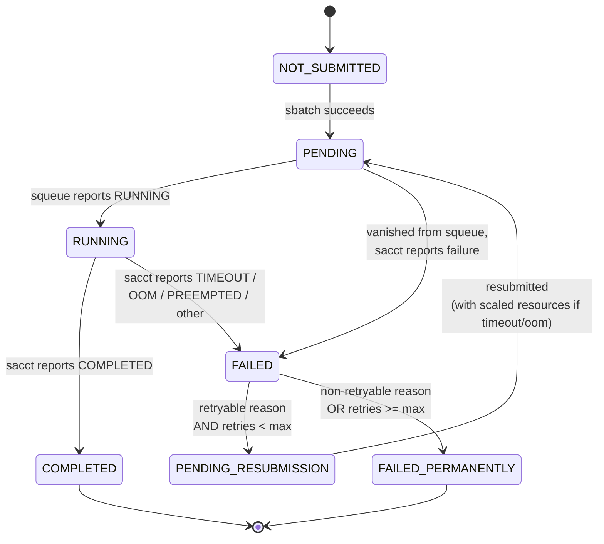
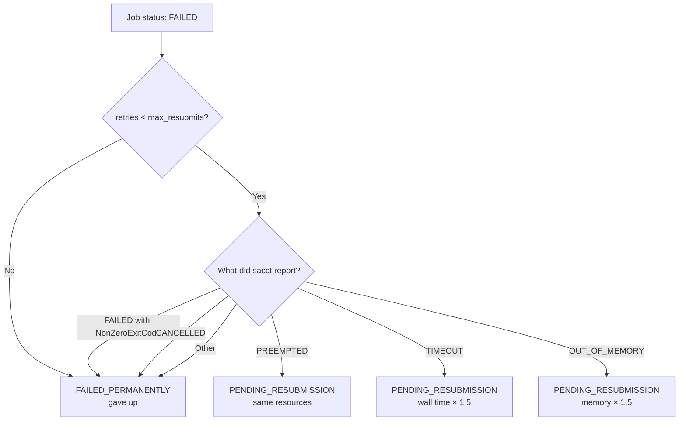
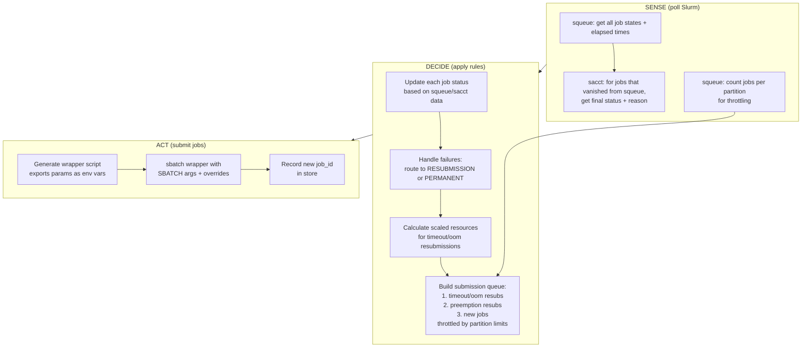
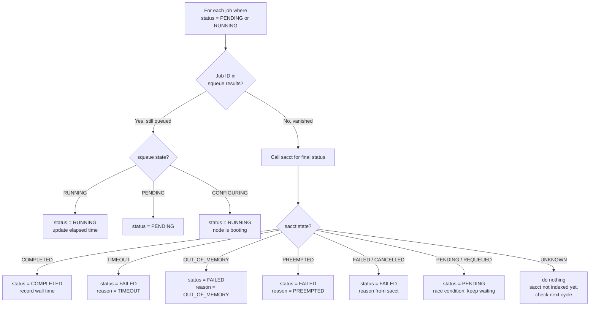

# Architecture

This document describes the internal design of slurmigo for contributors and developers.
If you are a user, see [README.md](README.md) instead.

---

## Overview

slurmigo runs a four-stage pipeline in a loop, once every `check_interval` seconds:

```
SENSE ──── DECIDE ──── ACT ──── DISPLAY ──── sleep ──── repeat
  │          │          │          │
  │    ┌─────┴─────┐    │          │
  │    │ State     │    │          │
  │    │ Machine   │    │          │
  │    │ Resubmit  │    │          │
  │    │ Scale     │    │          │
  │    │ Throttle  │    │          │
  │    └───────────┘    │          │
  │                     │          │
Poll Slurm         Submit jobs   Render TUI
(squeue, sacct)    (sbatch)      (Rich)
  │                     │          │
  ▼                     ▼          ▼
┌──────────────────────────────────────────┐
│              STORE (SQLite)              │
│  pipeline writes, display reads          │
└──────────────────────────────────────────┘
```

All four stages share the Store. The pipeline writes to it; the display reads from it.

---

## The Pipeline

The pipeline runs one cycle every `check_interval` seconds (configurable, default 60). Each cycle has four phases:

### Sense

Poll Slurm to learn what happened since the last cycle.

- Call `squeue` to get currently queued/running jobs and their elapsed time.
- For jobs that disappeared from `squeue`, call `sacct` to get their final status (COMPLETED, TIMEOUT, OUT_OF_MEMORY, PREEMPTED, etc.).
- Handle the race condition where `sacct` has not indexed the job yet (keep current status, check again next cycle).

### Decide

Apply business rules to determine what to do next.

- **State transitions**: Update each job's status based on what Sense learned. The state machine is:

  ```
  NOT_SUBMITTED ─── PENDING ─── RUNNING ─── COMPLETED
                                    │
                                    ├── FAILED (preempted) ─── PENDING_RESUBMISSION ─── PENDING (retry)
                                    ├── FAILED (timeout)   ─── PENDING_RESUBMISSION ─── PENDING (retry, more time)
                                    ├── FAILED (oom)       ─── PENDING_RESUBMISSION ─── PENDING (retry, more memory)
                                    └── FAILED (other / max retries) ─── FAILED_PERMANENTLY
  ```

- **Resource scaling**: If a job timed out, multiply its wall time by `timeout_multiplier`. If it ran out of memory, multiply its memory by `oom_multiplier`. These scaled values are stored per-job and passed to the next submission.

- **Throttling**: Count how many jobs the user currently has in each Slurm partition. Only submit new jobs if below the configured `max_jobs_per_partition` limit.

- **Priority**: When deciding which jobs to submit next, use this order:
  1. Timeout/OOM resubmissions (most urgent -- they already ran and almost succeeded)
  2. Preemption resubmissions (not the job's fault)
  3. New jobs (NOT_SUBMITTED, by task ID)

### Act

Execute the decisions.

- For each job to submit: generate a wrapper script that exports the parameters as environment variables and sources the user's original script. Submit the wrapper via `sbatch` with appropriate SBATCH directives (possibly with scaled `--time` or `--mem` overrides).
- Write updated job statuses to the State Store.

---

## Display

The fourth and final phase of each pipeline cycle.

- Reads from the Store to get current job counts and statuses.
- Renders the TUI dashboard using Rich: header, progress bar, defrag-style status grid, and detail tables (running, pending, completed, failed).
- Runs inside `Rich.Live`, which handles terminal refresh at its own rate (0.5s) between pipeline cycles.

Display is a separate module because:
- It has a completely different dependency (Rich) from the rest of the pipeline (subprocess, sqlite3).
- If we replace Rich with Textual or a web UI, only display.py changes.
- If we add interactive controls, they go in display.py.

---

## State Store

The State Store is the shared data layer. It is an SQLite database (`.slurmigo/state.db`).

- The pipeline writes to it (update job statuses, increment submit counts, store scaled resource values).
- The display reads from it (count jobs by status, list running/failed jobs).
- SQLite WAL mode allows concurrent reads and writes without locking.

The State Store is the single source of truth. If slurmigo is killed and restarted, it resumes from the State Store.

---

## Configuration

Configuration is loaded once at startup and does not change during execution.

- Source: `slurmigo.toml` (TOML file in working directory), with CLI argument overrides.
- A `Config` object is created and passed to all components that need it.
- No component reads config on its own -- it receives the Config object from the entry point.

---

## Codemap

```
src/slurmigo/
├── __init__.py        # version
├── __main__.py        # python -m slurmigo
├── cli.py             # Entry point: argparse, TOML config loading, main loop
├── sense.py           # SENSE: poll squeue/sacct, parse SBATCH directives
├── decide.py          # DECIDE: state machine, resubmission, scaling, throttling
├── act.py             # ACT: params parsing, wrapper generation, sbatch submission
├── store.py           # STORE: SQLite CRUD for job records
└── display.py         # DISPLAY: Rich TUI (grid, tables, progress, errors)
```

Each file maps to one box in the architecture diagram.

---

## Dependency Rules

Arrows mean "depends on" (imports from / calls into):

```
cli.py ─────────► sense, decide, act, display, store (wires everything)
     │
     ├──► sense.py ────► subprocess only     (never: decide, act, display, store)
     ├──► decide.py ───► store               (never: sense, act, display, subprocess)
     ├──► act.py ──────► sense, store         (never: decide, display)
     ├──► display.py ──► store               (never: sense, decide, act, subprocess)
     └──► store.py ────► sqlite3 only        (never: sense, decide, act, display)
```

**What each module must NOT import:**

| Module | Must NOT import |
|--------|----------------|
| sense.py | decide, act, display, store, Rich, sqlite3 |
| decide.py | sense, act, display, subprocess, Rich |
| act.py | decide, display, sqlite3, Rich |
| display.py | sense, decide, act, subprocess, sqlite3 |
| store.py | sense, decide, act, display, Rich, subprocess |
| cli.py | (can import everything -- it's the wiring layer) |

This ensures that changes in one area do not cascade through the codebase.

---

## Pipeline Logic

### Job State Machine



### Decision Logic at FAILED State



### One Pipeline Cycle (every check_interval seconds)



### Reconciliation Logic (SENSE to DECIDE detail)

How slurmigo figures out what happened to each job:


