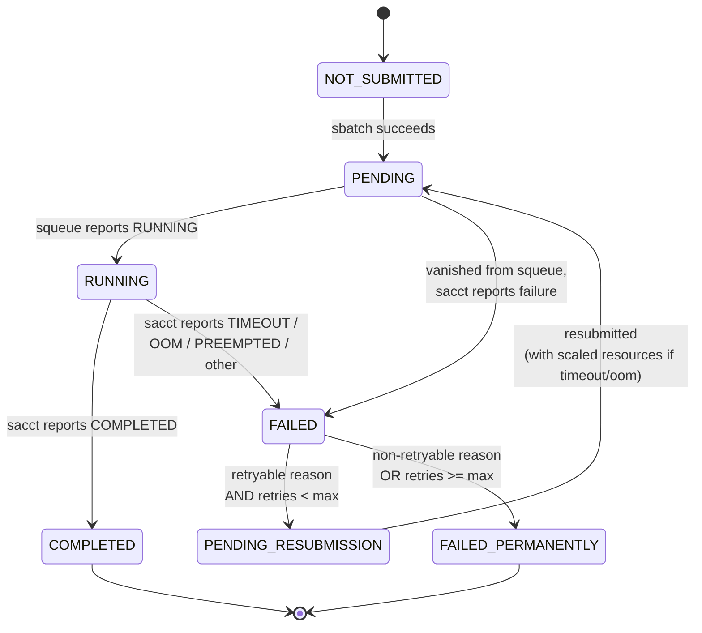

# slurmigo

A job manager for Slurm. Submit, monitor, and automatically recover large batches of jobs from a single terminal.

<!-- TODO: Add screenshot of the dashboard here -->

---

## Table of Contents

- [Why](#why)
- [Job State Machine](#job-state-machine)
- [How It Compares](#how-it-compares)
- [Features](#features)
- [Requirements](#requirements)
- [Installation](#installation)
- [Quick Start](#quick-start)
- [Configuration](#configuration)
- [Auto-Scaling](#auto-scaling)
- [The Dashboard](#the-dashboard)
- [Platform](#platform)
- [Contributing](#contributing)
- [Disclaimer](#disclaimer)
- [License](#license)
- [Contact](#contact)
- [TODO](#todo)

---

## Why

Slurm commands are designed for cluster administrators. For researchers running batch experiments, common tasks require long commands and manual bookkeeping.

If you run large parameter sweeps on Slurm, you know these problems:

- **Array job limits.** Most clusters cap job arrays at 1000 tasks. If you have 5,000 parameter combinations, you need workarounds.
- **Preempted jobs vanish.** On shared partitions, jobs get preempted. Finding which job disappeared and resubmitting them is manual work.
- **No global progress view.** `squeue` shows what is running right now. It does not tell you "3,200 of 5,000 jobs are done."
- **State is lost between sessions.** Close your terminal, and you lose track of what completed, what failed, and why.

slurmigo handles all of this. One command, one dashboard, automatic recovery.

---

## Job State Machine

Every job managed by slurmigo moves through these states:



- **Preempted** jobs are resubmitted with the same resources.
- **Timed-out** jobs are resubmitted with more wall time (configurable multiplier).
- **Out-of-memory** jobs are resubmitted with more memory (configurable multiplier).
- **Code errors** (non-zero exit code, segfault, etc.) are not retried.

---

## How It Compares

> TUI tools don't manage. Management tools don't have TUIs.

| Tool | Live TUI | Auto-Resubmit | Exceed Array Limit | Batch Orchestration |
|------|----------|---------------|---------------------|---------------------|
| turm | Yes | No | No | No |
| stui | Yes | No | No | No |
| SlurmCommander | Yes | No | No | No |
| submitit (Meta) | No | Yes | Yes | Yes |
| SEML | No | Yes | No | Yes |
| **slurmigo** | **Yes** | **Yes** | **Yes** | **Yes** |

Unlike submitit and SEML, slurmigo works with any existing sbatch script. You do not need to rewrite your code or wrap it in a Python API.

---

## Features

- **Live dashboard** -- a color-coded grid shows the status of every job at a glance
- **Automatic resubmission** -- preempted jobs are detected and resubmitted, up to a configurable limit
- **Auto-scaling** -- wall time and memory are scaled up automatically on timeout or OOM failures
- **No array size limit** -- manages any number of tasks by submitting individual jobs from a parameter file
- **Per-partition throttling** -- submits jobs up to your cluster's limits, no more
- **Persistent state** -- stop and restart at any time; progress is saved to disk
- **Lightweight** -- one dependency (`rich`)

---

## Requirements

- Python 3.9+
- `rich` library (installed automatically)
- Access to Slurm commands: `sbatch`, `squeue`, `sacct`

---

## Installation

```bash
pip install git+https://github.com/hainingpan/slurmigo.git
```

Or for development:

```bash
git clone https://github.com/hainingpan/slurmigo.git
cd slurmigo
pip install -e .
```

---

## Quick Start

### 1. Create a parameter file

One line per job. Each line contains the parameters for one run.

```
alpha=0.1 beta=0.5
alpha=0.2 beta=0.5
alpha=0.3 beta=1.0
alpha=0.4 beta=1.0
```

You can have any number of lines. There is no array limit.

### 2. Write a submission script

Parameters from each line of your parameter file are automatically available as environment variables inside the job.

```bash
#!/bin/bash
#SBATCH --partition=main
#SBATCH --time=01:00:00
#SBATCH --mem=4G
#SBATCH --output=logs/job_%j.out

# Parameters are automatically available as environment variables
python my_experiment.py --alpha $alpha --beta $beta
```

### 3. Run

The simplest way to start:

```bash
slurmigo --params params.txt --script run.sh
```

This submits your jobs, tracks their progress, resubmits preempted ones, and shows a live dashboard. Press Ctrl+C to stop at any time. Run the command again to resume -- all progress is saved.

If you want to customize settings (check interval, max retries, partition limits, scaling multipliers), create a `slurmigo.toml` file in your working directory. See [Configuration](#configuration) below. Once a config file exists, you can run with just:

```bash
slurmigo
```

Command-line options always override config file settings.

---

## Configuration

Create a `slurmigo.toml` file in your working directory. All fields are optional -- slurmigo uses sensible defaults for anything you omit. Command-line flags (e.g., `--interval`, `--max-resubmits`) override the corresponding config file settings.

```toml
# Required: path to your parameter file (one set of params per line)
params_file = "params.txt"

# Required: path to your sbatch submission script
script = "run.sh"

# Seconds between each poll cycle (default: 60)
check_interval = 60

# Maximum retry attempts per job (default: 3)
max_resubmits = 3

# Wall time multiplier on TIMEOUT resubmission (default: 1.5)
timeout_multiplier = 1.5

# Memory multiplier on OUT_OF_MEMORY resubmission (default: 1.5)
oom_multiplier = 1.5

# Maximum concurrent jobs per partition
[max_jobs_per_partition]
default = 150
main = 500
gpu = 150
```

### Configuration Reference

| Parameter | Default | Description |
|---|---|---|
| `params_file` | (required) | Path to the parameter file, one line per job |
| `script` | (required) | Path to your sbatch submission script |
| `check_interval` | `60` | Seconds between status checks |
| `max_resubmits` | `3` | Maximum retry attempts per failed job |
| `timeout_multiplier` | `1.5` | Wall time multiplier applied on TIMEOUT resubmission |
| `oom_multiplier` | `1.5` | Memory multiplier applied on OUT_OF_MEMORY resubmission |
| `max_jobs_per_partition` | `{"default": 150}` | Maximum concurrent jobs per Slurm partition |

---

## Auto-Scaling

When a job exceeds its wall time limit (TIMEOUT), slurmigo resubmits it with the wall time multiplied by `timeout_multiplier` (default: 1.5). When a job runs out of memory (OUT_OF_MEMORY), it is resubmitted with memory multiplied by `oom_multiplier` (default: 1.5).

Both types of resubmission are given priority over new jobs.

---

## The Dashboard

The live terminal dashboard shows:

- **Progress bar** -- overall completion percentage
- **Status grid** -- each block represents one job, colored by status:
  - Green: completed
  - Cyan: running
  - Yellow: pending or queued
  - Red: failed
  - Gray: not yet submitted
- **Detail tables** -- running jobs with elapsed time, pending jobs, recent completions, and failures with reasons

For large campaigns (thousands of jobs), the grid automatically zooms to show the active region.

---

## Platform

Tested on [Amarel HPC](https://oarc.rutgers.edu) (Rutgers University). Should work on any cluster running Slurm with standard commands (`sbatch`, `squeue`, `sacct`).

---

## Contributing

Contributions are welcome.

### Development Setup

For local development, clone the repo and install in editable mode:

```bash
git clone https://github.com/hainingpan/slurmigo.git
cd slurmigo
pip install -e .
```

Or with `uv`:

```bash
git clone https://github.com/hainingpan/slurmigo.git
cd slurmigo
uv sync
```

### Running Tests

```bash
pytest
```

Integration tests (require a real Slurm cluster):

```bash
pytest tests/integration/ -v
```

### Issues

For bug reports, questions, or feature requests, please open an issue on [GitHub](https://github.com/hainingpan/slurmigo/issues).

### Pull Requests

1. Fork the repository
2. Create a branch for your changes
3. Ensure tests pass (`pytest`)
4. Submit a pull request

---

## Disclaimer

Use at your own risk. Consult your cluster administrator before use. Do not set aggressive options (very short check intervals, very high job limits). Be a good neighbor on shared resources.

---

## License

BSD 3-Clause License

Copyright (c) 2025, Haining Pan

See [LICENSE](LICENSE) for details.

---

## Contact

Author: Haining Pan -- hnpan@terpmail.umd.edu

---

## TODO

- GPU-aware auto-scaling
- Interactive controls (cancel jobs, pause submission from the dashboard)
